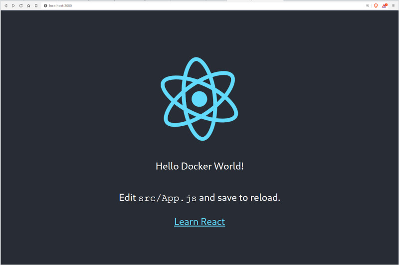

# 🚀 Cloud-Native Application Deployment on AWS EKS

## 🌟 Project Overview

This project, developed as the final assignment for a comprehensive DevOps course, showcases a state-of-the-art cloud-native application deployment pipeline, demonstrating expertise in cutting-edge DevOps practices and tools.

### 🛠️ Tools and Technologies

This project leverages a wide range of modern DevOps tools and technologies:

- Team work
- AWS (Amazon Web Services)
- EKS (Elastic Kubernetes Service)
- ArgoCD
- ECR (Elastic Container Registry)
- Grafana
- Prometheus
- SonarQube
- GitHub Actions

#### Project Portal
- 🌐 [Project Website](https://nx1x.github.io/final-project-static-website/)
- 📂 [Website Repository](https://github.com/NX1X/final-project-static-website)

As part of this project, I developed and shared a custom Terraform module for AWS EKS, showcasing my skills in Infrastructure as Code (IaC) and contributing to the DevOps community. The module is available on both the Terraform Registry and GitHub for easy access and collaboration.

#### Custom Terraform Module
- 📦 [Module on Terraform Registry](https://registry.terraform.io/modules/NX1X/eks/aws/latest)
- 🐙 [Module GitHub Repository](https://github.com/NX1X/terraform-aws-eks)

### 🔑 Key Components

| Category | Technologies |
|----------|--------------|
| 🏗️ **Application Architecture** | • Frontend<br>• Backend<br>• Database |
| 💻 **Development Environment** | • Dockerized components<br>• Docker Compose for local testing |
| ☁️ **Deployment Infrastructure** | • AWS (Amazon Web Services)<br>• EKS (Elastic Kubernetes Service)<br>• ECR (Elastic Container Registry) |
| 🔄 **Continuous Deployment** | • ArgoCD for GitOps<br>• Kubernetes manifests<br>• GitHub Actions |
| 📊 **Monitoring and Observability** | • Prometheus<br>• Grafana |
| 🔍 **Code Quality** | • SonarQube |
| 👥 **Collaboration** | • Team work |

## 🔄 Deployment Workflow

1. **🛠️ Local Development and Testing**
   - Crafted individual components (frontend, backend, database)
   - Engineered Dockerfiles for each component
   - Leveraged Docker Compose for local environment orchestration

2. **📦 Containerization**
   - Constructed Docker images for all components
   - Uploaded images to Amazon ECR (Elastic Container Registry)

3. **☸️ Kubernetes Configuration**
   - Authored Kubernetes manifests for deployments, services, and resources
   - Maintained manifests in the `dev` branch of the project repository

4. **🌐 EKS Cluster Setup**
   - Provisioned a robust EKS cluster on AWS
   - Configured IAM roles and policies for secure access

5. **🔁 ArgoCD Deployment**
   - Installed and configured ArgoCD on the EKS cluster
   - Established connection between ArgoCD and the project repository
   - Configured ArgoCD to monitor the `dev` branch and synchronize changes

6. **📈 Monitoring Setup**
   - Deployed Prometheus for comprehensive metrics collection
   - Integrated Grafana with Prometheus for powerful visualizations
   - Designed custom Grafana dashboards for real-time insights

7. **🔍 Quality Assurance**
   - Implemented SonarQube for continuous code quality monitoring
   - Set up GitHub Actions for automated CI/CD pipeline

## 🏆 Key Achievements

- ✅ Successfully implemented a GitOps workflow using ArgoCD
- ✅ Demonstrated mastery in containerization and orchestration technologies
- ✅ Engineered a robust monitoring solution for both infrastructure and application
- ✅ Gained invaluable hands-on experience with cloud-native technologies and AWS services
- ✅ Utilized SonarQube for maintaining high code quality standards
- ✅ Leveraged GitHub Actions for streamlined CI/CD processes

---

# Original Application Documentation

## Compose sample application

### Use with Docker Development Environments

You can open this sample in the Dev Environments feature of Docker Desktop version 4.12 or later.

[Open in Docker Dev Environments ](https://open.docker.com/dashboard/dev-envs?url=https://github.com/docker/awesome-compose/tree/master/react-java-mysql)

### React application with a Spring backend and a MySQL database

Project structure:
```
.
├── backend
│   ├── Dockerfile
│   ...
├── db
│   └── password.txt
├── compose.yaml
├── frontend
│   ├── ...
│   └── Dockerfile
└── README.md
```

[_compose.yaml_](compose.yaml)
```yaml
services:
  backend:
    build: backend
    ...
  db:
    # We use a mariadb image which supports both amd64 & arm64 architecture
    image: mariadb:10.6.4-focal
    # If you really want to use MySQL, uncomment the following line
    #image: mysql:8.0.27
    ...
  frontend:
    build: frontend
    ports:
    - 3000:3000
    ...
```

The compose file defines an application with three services `frontend`, `backend` and `db`.
When deploying the application, docker compose maps port 3000 of the frontend service container to port 3000 of the host as specified in the file.
Make sure port 3000 on the host is not already being in use.

> ℹ️ **_INFO_**
> For compatibility purpose between `AMD64` and `ARM64` architecture, we use a MariaDB as database instead of MySQL.
> You still can use the MySQL image by uncommenting the following line in the Compose file
> `#image: mysql:8.0.27`

## Deploy with docker compose

```
$ docker compose up -d
Creating network "react-java-mysql-default" with the default driver
Building backend
Step 1/17 : FROM maven:3.6.3-jdk-11 AS builder
...
Successfully tagged react-java-mysql_frontend:latest
WARNING: Image for service frontend was built because it did not already exist. To rebuild this image you must use `docker-compose build` or `docker-compose up --build`.
Creating react-java-mysql-frontend-1 ... done
Creating react-java-mysql-db-1       ... done
Creating react-java-mysql-backend-1  ... done
```

## Expected result

Listing containers must show three containers running and the port mapping as below:
```
$ docker ps
CONTAINER ID        IMAGE                       COMMAND                  CREATED             STATUS              PORTS                  NAMES
a63dee74d79e        react-java-mysql-backend    "java -Djava.securit…"   39 seconds ago      Up 37 seconds                              react-java-mysql_backend-1
6a7364c0812e        react-java-mysql-frontend   "docker-entrypoint.s…"   39 seconds ago      Up 33 seconds       0.0.0.0:3000->3000/tcp react-java-mysql_frontend-1
b176b18fbec4        mysql:8.0.19                "docker-entrypoint.s…"   39 seconds ago      Up 37 seconds       3306/tcp, 33060/tcp    react-java-mysql_db-1
```

After the application starts, navigate to `http://localhost:3000` in your web browser to get a colorful message.



Stop and remove the containers
```
$ docker compose down
Stopping react-java-mysql-backend-1  ... done
Stopping react-java-mysql-frontend-1 ... done
Stopping react-java-mysql-db-1       ... done
Removing react-java-mysql-backend-1  ... done
Removing react-java-mysql-frontend-1 ... done
Removing react-java-mysql-db-1       ... done
Removing network react-java-mysql-default
```
